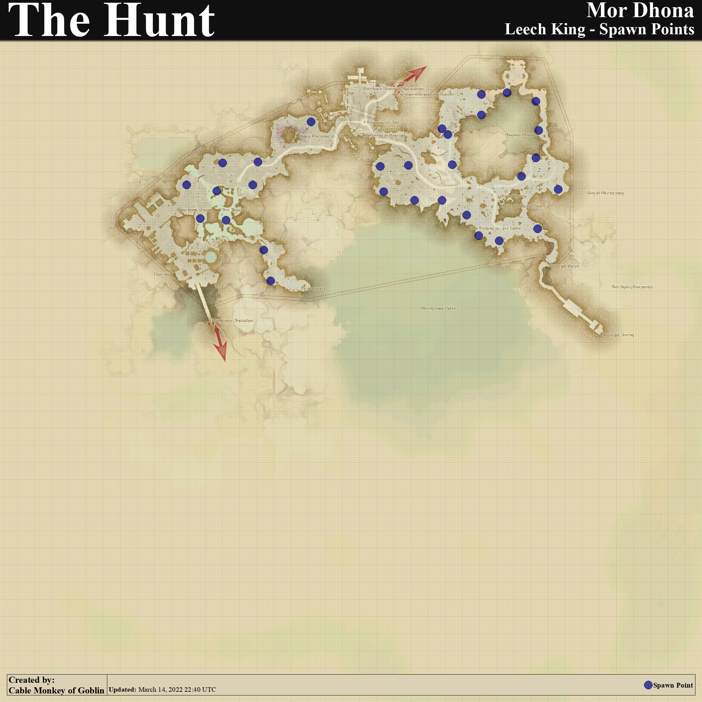

# FF14 B级狩猎地图

## 6.0 晓月之终途

    
 B怪位置 

|  地区   | B怪1  |  B怪2  |
|  :--:  | :--:  | :--:  |
| 萨维奈  | <figure> <figcaption>伊罗婆缇</figcaption>  </figure>  | <figure> <figcaption>金刚鸠摩罗</figcaption>  </figure>
| 迷津  | <figure> <figcaption>哞哞</figcaption>  </figure> | <figure> <figcaption>草贤人</figcaption>  </figure> 
| 加雷马  | <figure> <figcaption>皇帝的玫瑰</figcaption>  </figure>  | <figure> <figcaption>战争贩子</figcaption>  </figure>
| 叹息海  | <figure> <figcaption>起源石</figcaption>  </figure> | <figure> <figcaption>巨月蚤</figcaption>  </figure> 
| 厄尔庇斯 | <figure> <figcaption>肖科莫</figcaption>  </figure>  | <figure> <figcaption>尤姆卡克斯</figcaption>  </figure> 
| 天外天垓 | <figure> <figcaption>等级作弊仪</figcaption>  </figure> | <figure> <figcaption>欧斯克·雷伊</figcaption>  </figure>

## 5.0 暗影之逆焰

    
 B怪位置 

|  地区   | B怪1  |  B怪2  |
|  :--:  | :--:  | :--:  |
| 雷克兰德 | <figure> <figcaption>浓毛兽</figcaption>  </figure>  | <figure> <figcaption>伊兹帕帕洛特尔</figcaption>  </figure>
| 珂露西亚岛 | <figure> <figcaption>三合鸟儿</figcaption>  </figure> | <figure> <figcaption>不屈号</figcaption>  </figure> 
| 伊尔美格 | <figure> <figcaption>杜莫伊</figcaption>  </figure>  | <figure> <figcaption>狐首虺</figcaption>  </figure>
| 安穆·艾兰 | <figure> <figcaption>残虐杂技师</figcaption>  </figure> | <figure> <figcaption>大井巨虫</figcaption>  </figure> 
| 拉凯提卡大森林 | <figure> <figcaption>帕查玛玛</figcaption>  </figure> | <figure> <figcaption>启灵果</figcaption>  </figure> 
| 黑风海 | <figure> <figcaption>助祭大蟹</figcaption>  </figure> | <figure> <figcaption>徒手抓鱼 基乌嘶·渊斯</figcaption>  </figure>

## 4.0 红莲之狂潮

    
 B怪位置 

|  地区   | B怪1  |  B怪2  |
|  :--:  | :--:  | :--:  |
| 基拉巴尼亚边区 | <figure> <figcaption>奥祖鲁姆</figcaption>  </figure>  | <figure> <figcaption>影中暗 雅弥尼</figcaption>  </figure>
| 基拉巴尼亚山区 | <figure> <figcaption>蛇仆蚂蜓</figcaption>  </figure> | <figure> <figcaption>布卡卜</figcaption>  </figure> 
| 基拉巴尼亚湖区 | <figure> <figcaption>奇洼</figcaption>  </figure>  | <figure> <figcaption>玛涅斯</figcaption>  </figure>
| 红玉海 | <figure> <figcaption>姑获鸟</figcaption>  </figure> | <figure> <figcaption>剑豪 刑具</figcaption>  </figure> 
| 延夏 | <figure> <figcaption>大太</figcaption>  </figure> | <figure> <figcaption>闪雷击 鱼雷</figcaption>  </figure> 
| 太阳神草原 | <figure> <figcaption>阿苏黄</figcaption>  </figure> | <figure> <figcaption>俱利摩</figcaption>  </figure>

## 3.0 苍穹之禁城

    
 B怪位置 

|  地区   | B怪1  |  B怪2  |
|  :--:  | :--:  | :--:  |
| 库尔札斯西部高地 | <figure> <figcaption>克鲁泽</figcaption>  </figure>  | <figure> <figcaption>阿尔提克</figcaption>  </figure>
| 阿巴拉提亚云海 | <figure> <figcaption>飞舞翼 萨努瓦力</figcaption>  </figure> | <figure> <figcaption>斯奎克</figcaption>  </figure> 
| 龙堡参天高地 | <figure> <figcaption>骨颌彗星兵</figcaption>  </figure>  | <figure> <figcaption>提克斯塔</figcaption>  </figure>
| 翻云雾海 | <figure> <figcaption>惊慌稻草龙</figcaption>  </figure> | <figure> <figcaption>斯奇塔利斯</figcaption>  </figure> 
| 龙堡内陆低地 | <figure> <figcaption>布拉巨猿</figcaption>  </figure> | <figure> <figcaption>翼肢鲎</figcaption>  </figure> 
| 魔大陆阿济兹拉 | <figure> <figcaption>全能机甲</figcaption>  </figure> | <figure> <figcaption>利西达斯</figcaption>  </figure>

## 2.0 重生之境

    
 B怪位置 

|  地区   | B怪  |
|  :--:  | :--:  |
| 中拉诺西亚 | <figure> <figcaption>花林女郎</figcaption>  </figure> 
| 拉诺西亚低地 | <figure> <figcaption>宽耳凶蝠</figcaption>  </figure> 
| 东拉诺西亚 | <figure> <figcaption>血腥玛丽</figcaption>  </figure> 
| 西拉诺西亚 | <figure> <figcaption>暗盔魔蟹</figcaption>  </figure> 
| 拉诺西亚高地 | <figure> <figcaption>米腊德罗斯蜂鸟</figcaption>  </figure> 
| 拉诺西亚外地 | <figure> <figcaption>巫刻猎鹫</figcaption>  </figure> 
| 黑衣森林中央林区 | <figure> <figcaption>白鬼鼠王</figcaption>  </figure> 
| 黑衣森林东部林区 | <figure> <figcaption>击刺魔蜂索菲</figcaption>  </figure> 
| 黑衣森林南部林区 | <figure> <figcaption>君王鬼蜻蜓</figcaption>  </figure> 
| 黑衣森林北部林区 | <figure> <figcaption>天玑巨熊</figcaption>  </figure> 
| 中萨纳兰 | <figure> <figcaption>奥弗杰恩</figcaption>  </figure> 
| 南萨纳兰 | <figure> <figcaption>死灰复燃的阿尔宾</figcaption>  </figure> 
| 北萨纳兰 | <figure> <figcaption>永恒不灭的菲兰德副耀士</figcaption>  </figure> 
| 西萨纳兰 | <figure> <figcaption>阴沟毒液</figcaption>  </figure> 
| 东萨纳兰 | <figure> <figcaption>加特林针鼹</figcaption>  </figure> 
| 库尔札斯中央高地 | <figure> <figcaption>纳乌尔</figcaption>  </figure> 
| 摩杜纳 | <figure> <figcaption>水蛭王</figcaption>  </figure> 

